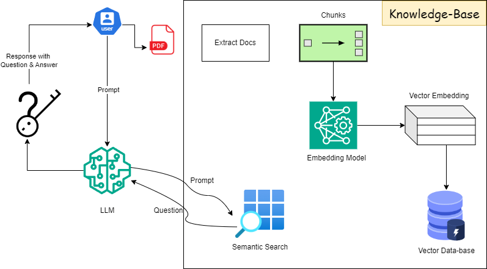

# Interview Question Creator (Gen AI)

An intelligent system that automatically generates comprehensive questions and answers from PDF documents using advanced language models and natural language processing.

## 🌟 Features

- **📚 Document Processing**
  - Support for PDF documents of any size
  - Intelligent text chunking with optimized token sizes
  - Smart batch processing for large documents
  - Maintains context across document sections
  - Automatic page reference tracking

- **🤖 AI-Powered Question Generation**
  - Generates diverse types of questions:
    - Conceptual understanding questions
    - Technical detail questions
    - Analytical questions
    - Application-based questions
  - Context-aware question generation
  - Intelligent fallback mechanisms
  - Duplicate question detection and filtering

- **💡 Smart Answer Generation**
  - Advanced answer processing with repetition prevention
  - Multi-document context retrieval
  - Sentence-level deduplication
  - Automatic answer length optimization
  - Source page references
  - Answer quality filtering

- **🎯 User Experience**
  - Clean and intuitive web interface
  - Real-time processing feedback
  - Progress tracking with detailed status updates
  - Interactive file preview
  - Downloadable CSV results
  - Tabulated Q&A display

- **✨Design and Informations**
   <!-- -  -->
   <!-- 
   
   
    -->

## 🚀 Technology Stack

- **Backend Framework**: FastAPI
- **AI/ML Components**:
  - LangChain for orchestration
  - FLAN-T5-small for text generation
  - FAISS for vector similarity search
  - Sentence Transformers for embeddings
- **Frontend**: HTML5, Bootstrap 5, jQuery, SweetAlert2
- **Document Processing**: PyPDF, TokenTextSplitter
- **Data Format**: CSV for output

## 📋 Prerequisites

- Python 3.11+
- 4GB+ RAM
- Storage space for model caching
- Internet connection for initial model download
- CUDA-compatible GPU (optional, for faster processing)

## ⚙️ Installation

### Using Poetry (Recommended)

1. **Install Poetry**
   ```bash
   curl -sSL https://install.python-poetry.org | python3 -
   ```

2. **Clone the Repository**
   ```bash
   git clone https://github.com/yourusername/interview-question-creator.git
   cd interview-question-creator
   ```

3. **Install Dependencies with Poetry**
   ```bash
   poetry install

   # Activate the virtual environment
   poetry shell
   ```

### Using Pip

1. **Clone the Repository**
   ```bash
   git clone https://github.com/yourusername/interview-question-creator.git
   cd interview-question-creator
   ```

2. **Set Up Virtual Environment**
   ```bash
   python -m venv venv

   # On Windows
   .\venv\Scripts\activate

   # On Unix or MacOS
   source venv/bin/activate
   ```

3. **Install Dependencies**
   ```bash
   pip install -r requirements.txt
   ```

## 🔧 Configuration

The system uses several optimized configurations:

1. **Model Settings**
   - FLAN-T5-small for efficient question generation
   - Optimized token limits (256 tokens)
   - Temperature: 0.8 for balanced creativity
   - Top-k: 50 for diverse outputs
   - Repetition penalty: 1.5
   - No-repeat-ngram-size: 3

2. **Processing Parameters**
   - Question chunk size: 256 tokens
   - Answer chunk size: 256 tokens
   - Chunk overlap: 20 tokens
   - Batch processing: 10 pages at a time
   - Maximum 15 questions per document
   - Answer retrieval: Top 2 most relevant chunks

3. **Quality Control**
   - Automatic duplicate removal
   - Minimum answer length validation
   - Repetitive content filtering
   - Sentence-level deduplication
   - Maximum answer length truncation (1000 chars)

## 🚀 Usage

1. **Start the Server**
   ```bash
   # Using Poetry
   poetry run uvicorn app:app --host 0.0.0.0 --port 8080 --reload

   # Using Pip
   uvicorn app:app --host 0.0.0.0 --port 8080 --reload
   ```

2. **Access the Application**
   - Web Interface: http://localhost:8080
   - API Documentation: http://localhost:8080/docs

3. **Using the Application**
   1. Upload your PDF document
   2. Monitor the processing status
   3. Review generated questions and answers
   4. Download the CSV output or view in-browser table

## 📚 API Endpoints

### `GET /`
- Returns the main web interface
- No parameters required

### `POST /upload`
- Uploads a PDF document
- Parameters:
  - `file`: PDF file (multipart/form-data)
- Returns: Upload confirmation and file path

### `POST /analyze`
- Generates questions and answers from uploaded PDF
- Parameters:
  - `pdf_filename`: Name of the uploaded file
- Returns: Generated Q&A in CSV format and JSON response

## 📊 Output Format

The generated CSV file contains:
- Questions with page references
- Cleaned and processed answers
- Source page numbers
- Properly formatted content without repetition

## 🛠️ Development

To contribute to the project:

1. Fork the repository
2. Create a feature branch
3. Make your changes
4. Run tests (if available)
5. Submit a pull request

## ⚠️ Known Limitations

- Processing very large PDFs (>1000 pages) may take significant time
- Quality of questions depends on document clarity
- Some technical documents may need multiple passes
- GPU acceleration recommended for large documents
- Maximum token length of 256 for each chunk
- Limited to 15 questions per document for quality control

## 🔍 Troubleshooting

Common issues and solutions:

1. **Token Length Errors**
   - The system automatically handles token length issues
   - Chunks are processed in smaller sizes (256 tokens)
   - Answers are automatically truncated if too long

2. **Repetitive Outputs**
   - Implemented multiple layers of repetition prevention
   - Sentence-level deduplication
   - N-gram repetition blocking
   - Answer quality filtering

3. **Memory Issues**
   - Batch processing of pages
   - Automatic resource cleanup
   - CUDA cache clearing when available

## 📝 License

This project is licensed under the MIT License - see the [LICENSE](LICENSE) file for details.

## 🤝 Contributing

Contributions are welcome! Please feel free to submit a Pull Request. For major changes, please open an issue first to discuss what you would like to change.

## 📧 Contact

For questions and feedback, please open an issue in the GitHub repository.

---

Made with ❤️ using Python and Open Source LLM models 🫰🏼